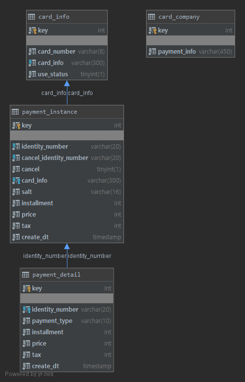
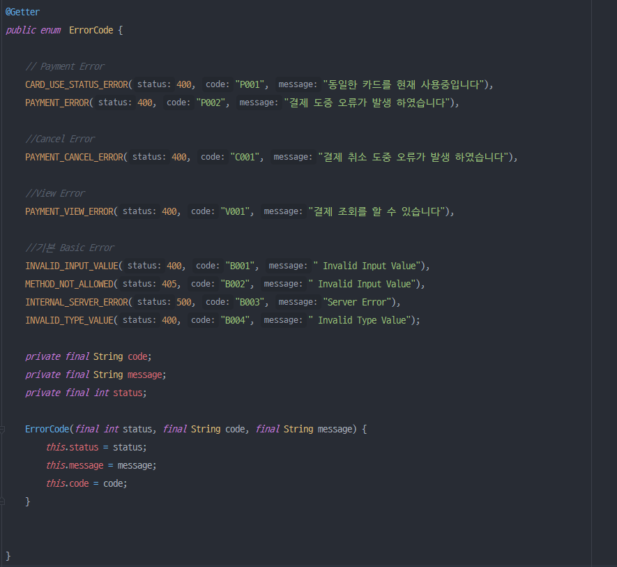
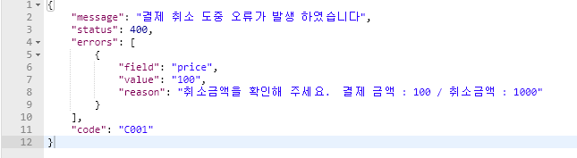
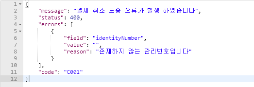
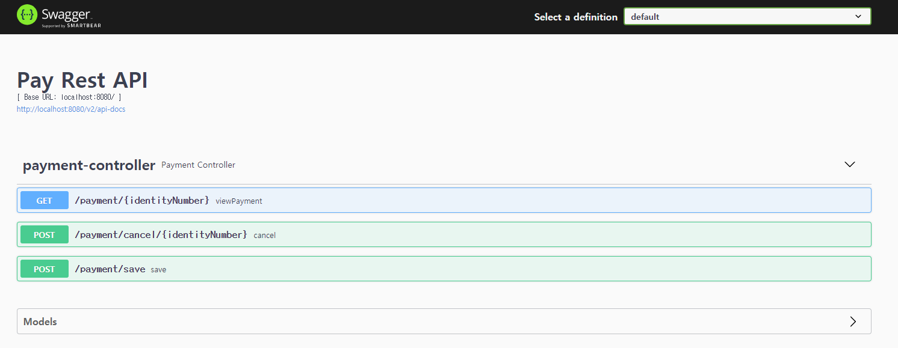
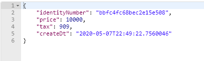
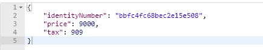
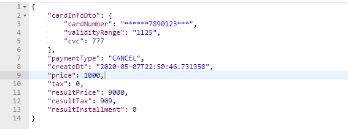

# Rest API 기반 결제시스템

## 개발 환경
* Java 11
* Gradle
* Spring Boot
* H2
* Junit5
* Swagger
* R2DBC
---
<br/>

## 테이블 설계

1. card_info : 카드정보 Table
2. cafd_company : 카드사 Table
3. payment_instance : 결제 정보 Table
4. payment_detail : 결제 히스토리 내역 정보 Table
---
<br/>

## 개발 전략  
### WebFlux  
개발은 일반적인 MVC 방법이 아닌 WebFlux 방식으로 구현하였습니다  
WebFlux를 사용한 이유는 다음과 같습니다  

>1. 결제 서비스 많은 인증통신으로 속도는 중요하다     
>2. 과제가 H2 DB를 사용한다  
>3. R2DBC가 GA가 되었다  

그래서 앞으로의 개발 방향과 트래픽증가를 생각하여`MVC구조보다 WebFlux방식의 사용이 필요`하다고 생각했습니다  

<br/>

### Error Handler  
Error는 전역`RestControllerAdvice`를 설정하여 한곳에서 설정 가능하도록 구현하였습니다  

 
 
 <br/>
 
 상황에 맞는 Error를 설정하여 결과를 줄 수 있습니다  
 
 case 1  
   
 
  case 2  
  

<br/>

### 카드 정보 암호화  
민감한 카드정보 암호화에는 NIST(National Institute of Standards and Technology, 미국표준기술연구소)에서  
승인한 대칭키 알고리즘인 `PBKDF2`를 사용하였습니다  

<br/>

### Rest Document  
Swagger를 사용하여 Rest Doc을 확인할 수 있도록 설정하였습니다  
[swagger-ui.html](localhost:8080/swagger-ui.html)을 통해 접근하실 수 있습니다  



<br/>

### Multi Thread 방어  
각 DB접근에 Transaction에 격리상태를`isolation = Isolation.SERIALIZABLE)`로 동시접근을 제어하였습니다

<br/>

### 결과  

**결제**  
  

차례로 : 관리번호, 금액, 부가가치세, 결제시간  

<br/>

**취소**  
  

차례로 : 관리번호, 총결제액, 총부가가치세  

<br/>

**조회**  
  

차례로 : 카드정보, 행동타입, 결제시간, 금액, 부가가치세, 총결제액, 총부가가치세, 할부기간  

---
<br/>

### Build 및 실행 방법
**Build**
```text
$ git clone git@github.com/renuevo/pay-homework-v4.git
$ cd pay-homework-v4
$ ./gradlew build
// war 파일로 생성 됩니다
```

**BootRun**
```text
$ ./gradlew bootRun
```

**Test**
```text
$ ./gradlew test
```